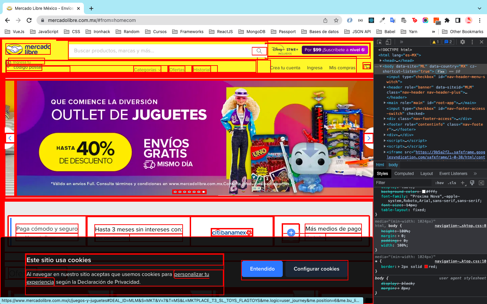
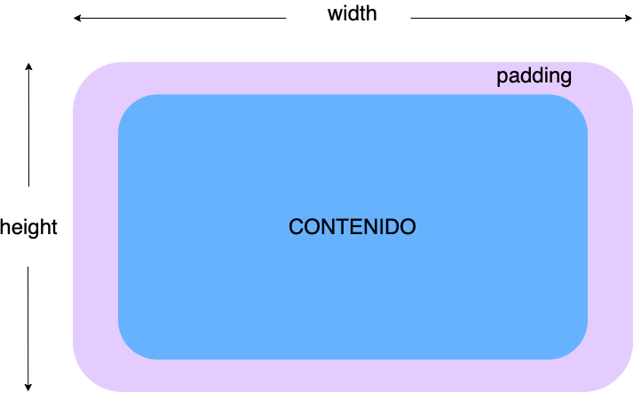
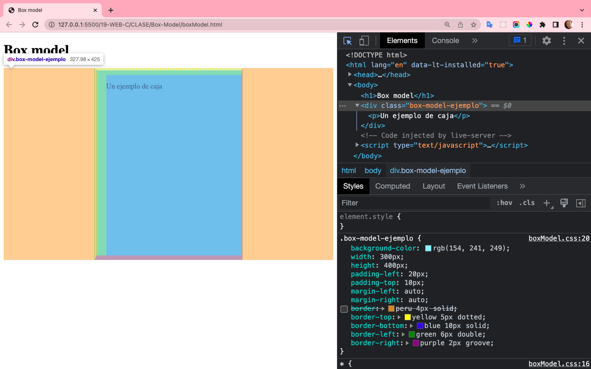

# Box model

# Modelo de caja

En la web todos los elementos se consideran como cajas, aunque no se vean así precisamente.

* * *
💡 Mostrar una página web. Todos los elementos que aparecen en una pagina web tienen una forma rectangular, es decir una caja, aunque no sea evidente.  Ponerle un color de borde a todos los elementos con ayuda del inspector de elementos.



* * *

## Como funciona el modelo de Caja




Cada una de las cajas de una página web tiene propiedades como:

### width

ancho del elemento

### height

altura del elemento

### padding

espacio entre el contenido y el borde de la caja

### border

la línea que se encuentra fuera del relleno.

### margin

espacio fuera de la caja y respecto alrededor de la caja

* * *
💡 Utilizar un div, he ir explicando los conceptos previos: agregar width, height, padding, padding-left, padding top, margin.
* * *

```html
<!DOCTYPE html>
<html lang="en">
<head>
  <meta charset="UTF-8">
  <meta http-equiv="X-UA-Compatible" content="IE=edge">
  <meta name="viewport" content="width=device-width, initial-scale=1.0">
  <title>Box model</title>
  <link rel="stylesheet" href="./boxModel.css">
</head>
<body>
  <h1>Box model</h1>
  <div class="box-model-ejemplo">
    <p>Un ejemplo de caja</p>
  </div>
</body>
</html>
```

```css
.box-model-ejemplo {
  background-color: rgb(154, 241, 249);
  width: 300px;
  height: 400px;
  padding-left: 20px;
  padding-top: 10px;
  /* Centrar el div horizontalmente */
  margin-left: auto;
  margin-right: auto;
  /* Border */
  /* Border para todos los lados */
  /* border: peru 4px solid; */
  border-top: yellow 5px dotted;
  border-bottom: blue 10px solid;
  border-left: green 6px double;
  border-right: purple 2px groove;
}
```

Inspeccionar la pagina y seleccionar la caja para visualizar el width y height que tiene nuestra caja.



Preguntar a los alumnos ¿Por qué cuándo seleccionamos nuestra caja, vemos una anchura diferente a la que le habíamos dado previamente?
Esto pasa porque el modelo de caja tradicional, la anchura total de un elemento es igual a width + paddings + border

* * *

💡 width + paddings + border
300    + 20 + (6 + 2) = 328

* * *

Para que nuestra caja respete la anchura que le habíamos establecido, agregaremos {box-sizing: border-box;}


El valor `border-box` en el `box-sizing` hace que el `padding` y el `border` pasen a formar parte del cálculo del ancho de la caja y no lo suman posteriormente.

# Lecturas de Campus

- Kata Intro a la Web - CSS
- Kata Intro a la Web - Box Model